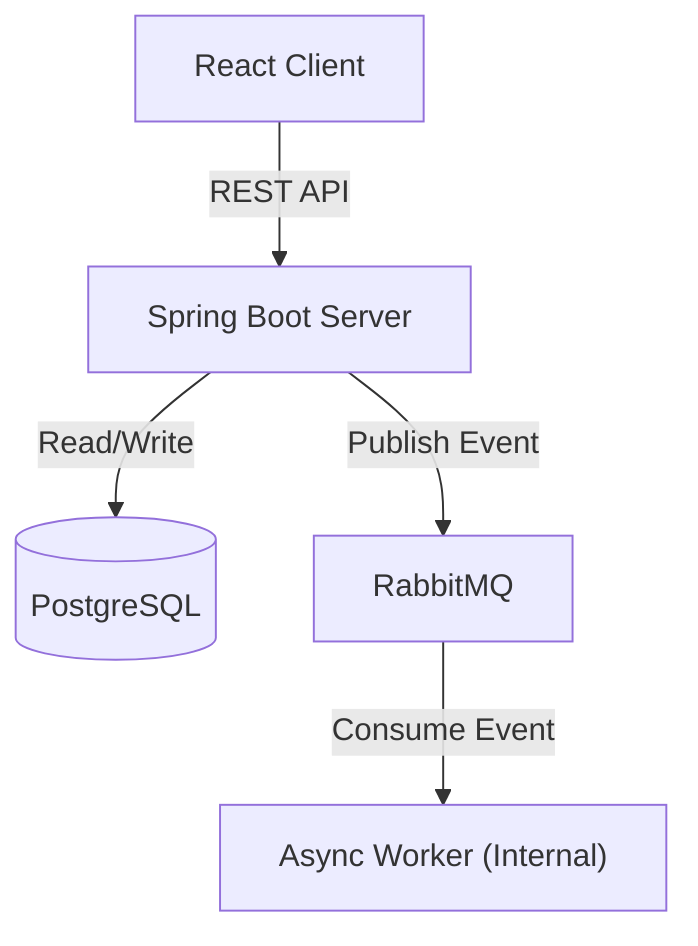

# NexusFlow: Enterprise Order Processor

NexusFlow is a **senior-level enterprise order processing platform** engineered for high concurrency, scalability, and data integrity. It orchestrates a secure Spring Boot backend with a responsive React frontend, utilizing event-driven architecture to handle complex workflows efficiently.

## 🌟 Key Features

### 1. Robust Data Integrity (Optimistic Locking)
- **Problem**: In high-concurrency environments, multiple users might attempt to purchase the last item simultaneously ("The Lost Update" problem).
- **Solution**: Implemented JPA `@Version` based optimistic locking on `Product` entities.
- **Outcome**: Ensures strict ACID compliance. If concurrent transactions conflict, the system detects the version mismatch and handles the `ObjectOptimisticLockingFailureException` gracefully, preventing negative stock and ensuring data consistency.

### 2. Event-Driven Architecture (RabbitMQ)
- **Decoupling**: Order placement is decoupled from heavy post-processing tasks (inventory sync, notifications, analytics).
- **Resilience**: Uses **RabbitMQ** to buffer events. If downstream services fail, messages persist in the `order_placed_queue` for retry, ensuring zero data loss.
- **Performance**: shifting heavy lifting to async workers reduces the Order API response time to ~100ms, compared to seconds in synchronous systems.

### 3. Enterprise-Grade Security
- **Stateless Authentication**: Secured via **Spring Security** and **JWT (JSON Web Tokens)**.
- **Role-Based Access Control (RBAC)**: Fine-grained permissions for `User` and `Admin` roles protecting sensitive endpoints.

### 4. Comprehensive Input Validation
- **Bean Validation**: All DTOs validated with `@Valid`, `@NotNull`, `@Min`, `@Max`, `@NotBlank` annotations.
- **Detailed Error Messages**: User-friendly validation error responses with field-specific messages.

### 5. Advanced Exception Handling
- **Custom Exceptions**: `ResourceNotFoundException`, `InsufficientStockException` for business logic errors.
- **Optimistic Locking Handler**: Graceful handling of concurrent modification conflicts.
- **Structured Error Responses**: Consistent error format with timestamp, status, message, and validation errors.

### 6. API Documentation (Swagger/OpenAPI)
- **Interactive API Explorer**: Full REST API documentation with try-it-out functionality.
- **JWT Integration**: Built-in authentication support in Swagger UI.

### 7. Observability & Monitoring
- **Spring Actuator**: Health checks, metrics, and application monitoring endpoints.
- **Structured Logging**: SLF4J with contextual logging across all services.

## 🏗 System Architecture

The system follows a microservices-inspired architecture managed via Docker Compose:

1.  **Frontend**: React (Vite) + TypeScript for a type-safe, performant UI.
2.  **Backend**: Spring Boot 3.2 REST API.
3.  **Database**: PostgreSQL 15 (Relational/ACID).
4.  **Message Broker**: RabbitMQ (Async messaging).

### Architecture Diagram


## 🛠 Tech Stack

### Backend
- **Framework**: Spring Boot 3.2
- **Language**: Java 17
- **Data**: Spring Data JPA, PostgreSQL
- **Security**: Spring Security, JWT (io.jsonwebtoken)
- **Messaging**: Spring AMQP (RabbitMQ)
- **Tools**: Lombok, Maven

### Frontend
- **Framework**: React 19
- **Build Tool**: Vite 7
- **Language**: TypeScript 5
- **Routing**: React Router DOM 7
- **HTTP Client**: Axios
- **Styling**: Vanilla CSS (Modular & Responsive)

## 🚀 Getting Started

### Quickstart (Docker Compose)
- `docker-compose up --build`
- Frontend: http://localhost:5173
- API: http://localhost:8080
- Swagger: http://localhost:8080/swagger-ui.html (use the token field to authorize)
- Health/Metrics: http://localhost:8080/actuator/health, http://localhost:8080/actuator/metrics
- RabbitMQ UI: http://localhost:15672 (guest/guest)

### Prerequisites
- [Docker Desktop](https://www.docker.com/products/docker-desktop/) (Required)
- Java 17+ & Node.js 18+ (Optional, for local non-Docker dev)

### Deployment (Recommended)
Run the entire stack with a single command:

```bash
docker-compose up --build
```

**Access Points**:
- **Frontend**: [http://localhost:5173](http://localhost:5173)
- **Backend API**: [http://localhost:8080](http://localhost:8080)
- **Swagger UI**: [http://localhost:8080/swagger-ui.html](http://localhost:8080/swagger-ui.html)
- **API Docs**: [http://localhost:8080/api-docs](http://localhost:8080/api-docs)
- **Health Check**: [http://localhost:8080/actuator/health](http://localhost:8080/actuator/health)
- **Metrics**: [http://localhost:8080/actuator/metrics](http://localhost:8080/actuator/metrics)
- **RabbitMQ Dashboard**: [http://localhost:15672](http://localhost:15672) (User: `guest`, Pass: `guest`)

### Local Development (Optional)
- Backend: `cd server && mvn spring-boot:run`
- Frontend: `cd client && npm install && npm run dev`
- Tests: `cd server && mvn test`
- Frontend build check: `cd client && npm run build`
- Health check: `curl http://localhost:8080/actuator/health`

### Auth & Roles
- Register or login at `/api/auth/register` or `/api/auth/login` (Swagger is the fastest way to try it).
- In Swagger, paste the JWT in **Authorize** without the `Bearer` prefix.
- Default role: `ROLE_CUSTOMER`; promote to admin manually or use the seeded admin credentials below.

### Dev seed (auto)
- Default admin (dev/demo): `admin` / `admin123` (seed is enabled when `SEED_ENABLED=true`, default).
- Sample products are auto-created when the DB is empty.

### Promote to Admin (quick SQL)
```sql
update users set role = 'ROLE_ADMIN' where username = 'your_username';
```

### CI (GitHub Actions)
- Workflow: `.github/workflows/ci.yml`
- Backend: `mvn verify` in `server`
- Frontend: `npm ci && npm run build` in `client`

> **Note:** Use JDK 17 for local Maven builds. Using newer JDKs (e.g., 21/23) can trigger `TypeTag :: UNKNOWN` javac errors with Lombok; Docker Compose already uses the correct JDK.

### API Documentation (Swagger)
1) Start services, then open [http://localhost:8080/swagger-ui.html](http://localhost:8080/swagger-ui.html)
2) Click **Authorize** and paste your JWT (no `Bearer ` prefix needed)
3) Try any endpoint directly from the UI

### Validation & Errors
- All request DTOs are validated (`@Valid`, `@NotNull`, `@Min`, `@NotBlank`)
- Errors return a structured payload: `timestamp`, `status`, `error`, `message`, `path`, and `validationErrors`
- Concurrency conflicts return HTTP 409 with guidance to retry

### Monitoring
- Health: `/actuator/health`
- Metrics: `/actuator/metrics`
- Prometheus scrape: `/actuator/prometheus`

### Default Roles
- **User**: Register a new account via the UI.
- **Admin**: Manually update the database `users` table to promote a user to `ROLE_ADMIN` to access inventory management features.

## 🧪 Future Improvements
- **Integration Testing**: Add Testcontainers to simulate real PostgreSQL/RabbitMQ instances during CI/CD.
- **Observability**: Integrate Prometheus and Grafana for metrics monitoring.
