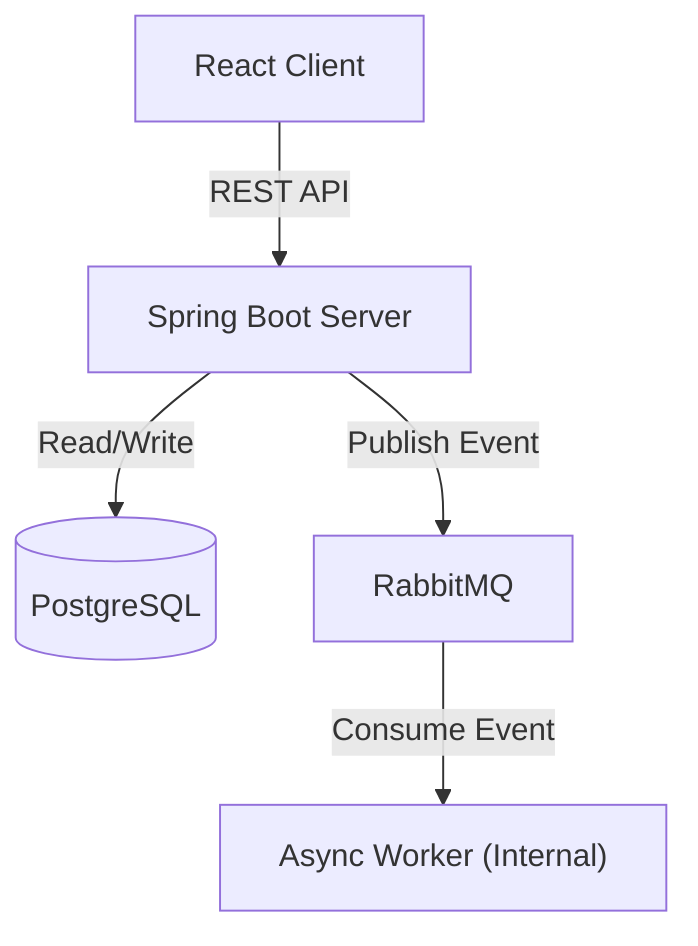

# NexusFlow: Enterprise Order Processor

NexusFlow is a **senior-level enterprise order processing platform** engineered for high concurrency, scalability, and data integrity. It orchestrates a secure Spring Boot backend with a responsive React frontend, utilizing event-driven architecture to handle complex workflows efficiently.

## 🌟 Key Features

### 1. Robust Data Integrity (Optimistic Locking)
- **Problem**: In high-concurrency environments, multiple users might attempt to purchase the last item simultaneously ("The Lost Update" problem).
- **Solution**: Implemented JPA `@Version` based optimistic locking on `Product` entities.
- **Outcome**: Ensures strict ACID compliance. If concurrent transactions conflict, the system detects the version mismatch and handles the `ObjectOptimisticLockingFailureException` gracefully, preventing negative stock and ensuring data consistency.

### 2. Event-Driven Architecture (RabbitMQ)
- **Decoupling**: Order placement is decoupled from heavy post-processing tasks (inventory sync, notifications, analytics).
- **Resilience**: Uses **RabbitMQ** to buffer events. If downstream services fail, messages persist in the `order_placed_queue` for retry, ensuring zero data loss.
- **Performance**: shifting heavy lifting to async workers reduces the Order API response time to ~100ms, compared to seconds in synchronous systems.

### 3. Enterprise-Grade Security
- **Stateless Authentication**: Secured via **Spring Security** and **JWT (JSON Web Tokens)**.
- **Role-Based Access Control (RBAC)**: Fine-grained permissions for `User` and `Admin` roles protecting sensitive endpoints.

## 🏗 System Architecture

The system follows a microservices-inspired architecture managed via Docker Compose:

1.  **Frontend**: React (Vite) + TypeScript for a type-safe, performant UI.
2.  **Backend**: Spring Boot 3.2 REST API.
3.  **Database**: PostgreSQL 15 (Relational/ACID).
4.  **Message Broker**: RabbitMQ (Async messaging).

### Architecture Diagram


## � Tech Stack

### Backend
- **Framework**: Spring Boot 3.2
- **Language**: Java 17
- **Data**: Spring Data JPA, PostgreSQL
- **Security**: Spring Security, JWT (io.jsonwebtoken)
- **Messaging**: Spring AMQP (RabbitMQ)
- **Tools**: Lombok, Maven

### Frontend
- **Framework**: React 19
- **Build Tool**: Vite 7
- **Language**: TypeScript 5
- **Routing**: React Router DOM 7
- **HTTP Client**: Axios
- **Styling**: Vanilla CSS (Modular & Responsive)

## 🚀 Getting Started

### Prerequisites
- [Docker Desktop](https://www.docker.com/products/docker-desktop/) (Required)
- Java 17+ & Node.js 18+ (Optional, for local non-Docker dev)

### Deployment (Recommended)
Run the entire stack with a single command:

```bash
docker-compose up --build
```

**Access Points**:
- **Frontend**: [http://localhost:5173](http://localhost:5173)
- **Backend API**: [http://localhost:8080](http://localhost:8080)
- **RabbitMQ Dashboard**: [http://localhost:15672](http://localhost:15672) (User: `guest`, Pass: `guest`)

### Default Roles
- **User**: Register a new account via the UI.
- **Admin**: Manually update the database `users` table to promote a user to `ROLE_ADMIN` to access inventory management features.

## 🧪 Future Improvements
- **Integration Testing**: Add Testcontainers to simulate real PostgreSQL/RabbitMQ instances during CI/CD.
- **Observability**: Integrate Prometheus and Grafana for metrics monitoring.
